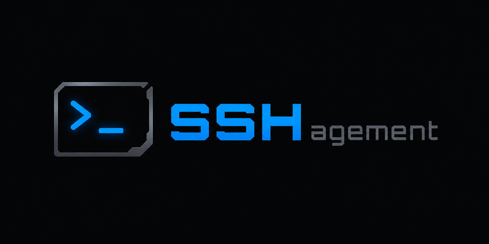

<div align="center">

#  SSHagement

<a href="#english"></a>
<a href="LICENSE"></a>


<br>


**Offline-first SSH client for Windows. No-cloud, no accounts, no telemetry.**



https://github.com/user-attachments/assets/1018a11a-ecb4-45a4-b91c-7418e9abdae5

</div>

---

### Why SSHagement

A fast, native SSH client that keeps **everything on your machine**. No sign-in, no sync
servers, no analytics. Your credentials never touch a disk in plaintext — they live in the
**Windows Credential Manager**, and backups never contain secrets.

> [!NOTE]
> SSHagement is **100% offline**. It never phones home, has no account system, and collects
> no telemetry — your hosts, keys and history stay on your PC.

### Features

- **Multi-tab + split panes** — recursive split layout; terminals stay alive across tab
  switches and re-splits (never reconnect).
- **Multi-window** with **live tab transfer** — drag a tab out to tear it off into a new
  window; the SSH session moves without dropping.
- **Snippets** with folders/subgroups — insert or run into the active pane, drag onto a
  terminal, multi-line commands paste correctly (bracketed paste).
- **Command Palette** (`Ctrl+Shift+P`) — fuzzy search over hosts, snippets and actions.
- **Scrollback search** (`Ctrl+Shift+F`) and **broadcast input** to every pane in a tab.
- **Auth**: password, private key (incl. **encrypted-key passphrases**), and **SSH agent**
  (OpenSSH named pipe + Pageant).
- **Proxy**: SOCKS5 (proxy-side DNS, no leak) and HTTP CONNECT.
- **Known Hosts** — TOFU host-key pinning with warn-on-change.
- **Auto-reconnect** with exponential backoff, **startup commands** per host.
- **Obsidian-style folders** for hosts and snippets; **import from `~/.ssh/config`**.
- **Customizable keybindings**, **interface scale**, F11 fullscreen, maximize pane.
- **Config import/export** to JSON (secrets are never exported).
- Remembers **window size / position / maximized** state between sessions.

### Security model

- Secrets (passwords, key passphrases, proxy creds) are stored **only** in the Windows
  Credential Manager — never in plaintext on disk.
- Backup/export **never** includes secrets.
- Host keys use **trust-on-first-use** pinning and warn if a key changes.
- SOCKS5 proxy resolves the hostname **proxy-side** (no DNS leak).

> [!IMPORTANT]
> Secrets live in the Windows Credential Manager, **not** in the app's config files. If you
> reinstall Windows or move to another PC, export a backup **and** re-enter your passwords/keys
> there — the backup intentionally does not carry them.

### Tech stack

- **Backend** — [Tauri 2](https://tauri.app) + Rust, SSH via [`russh`](https://github.com/Eugeny/russh)
  (`aws-lc-rs` crypto), secrets via `keyring`.
- **Frontend** — [SvelteKit](https://kit.svelte.dev) + Svelte 5 runes + TypeScript,
  Tailwind CSS v4, terminal via [xterm.js](https://xtermjs.org).

### Building from source

Requires Node.js, Rust (MSVC toolchain) and the Tauri prerequisites.

```sh
npm install
npm run tauri dev     # run in dev
npm run tauri build   # produce a release build
```

> [!WARNING]
> The release build is **not code-signed**, so Windows SmartScreen may warn on first
> launch. Click **More info → Run anyway** — or build it yourself from source above.

### License

[MIT](LICENSE) © 2026 tglagcs